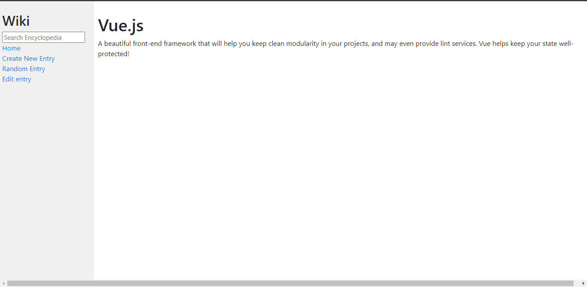
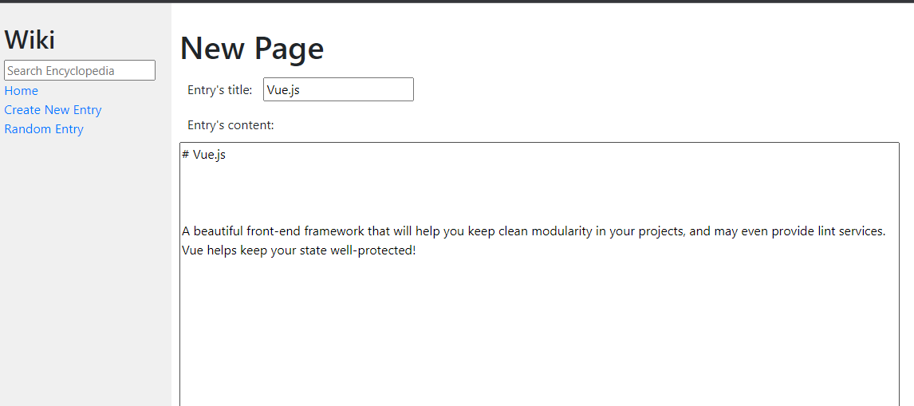

## Wiki

[Check the main repo](https://github.com/JorgeEncinas/CS50-Web-Compiled)

This is a wiki-like site, where you save entries to markdown files (.md extension). CS50 already provides ways to save and retrieve the entries,
I just had to create the requested functions in the Backend. 

[Project Requirements are specified here](https://cs50.harvard.edu/web/2020/projects/1/wiki/)

### Images

